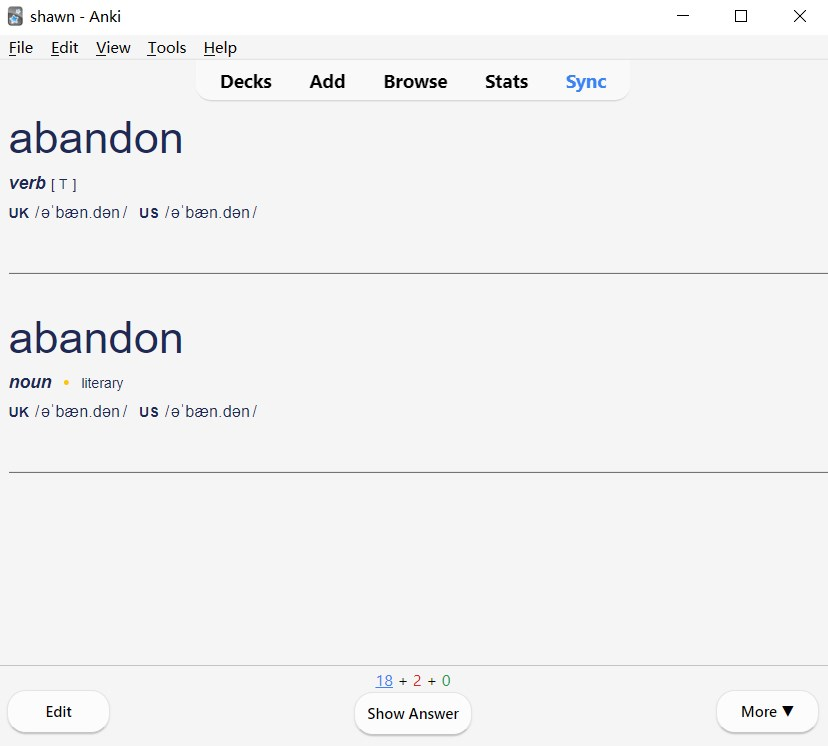
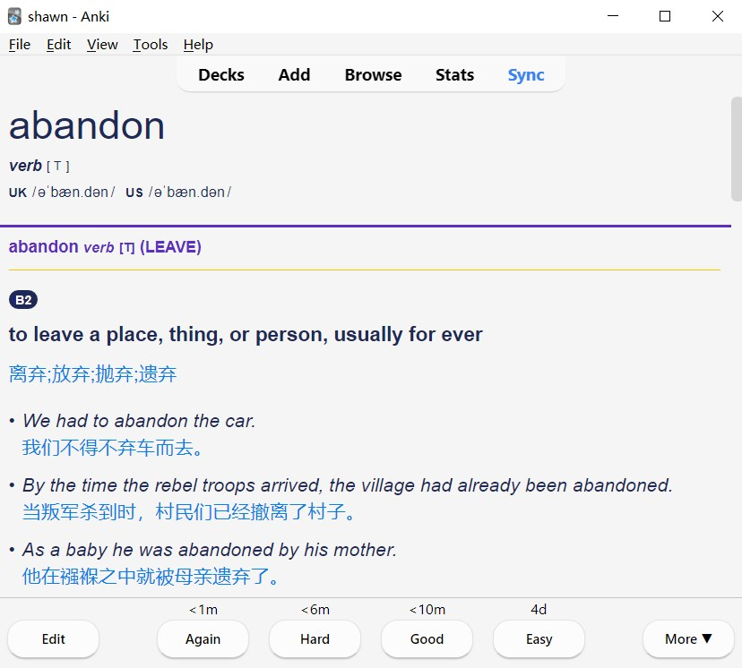

# IELTS-Dict-Cards-Metadata-Generator

## Intro

It's a simple online dictionary words fetching project for generating IELTS **anki cards**. It contains two main script `main.js` for fetching html and `html2notes.js` for converting html to notes in anki.

All words in `words.txt` comes from the [IELTS](https://github.com/Quasimurdock/IELTS) repo.

## Sample

### Front side

### Back side

## How to use

### Simply import

If u just wanna use the note cards of IELTS words, follow the steps below:

1. Find the release package in the **right nav bar** of this page and download it.
2. Import the `.apkg` file inside that package to Anki.

### Develop

There're actually two ways of generating notes to ur Anki program:

- `pnpm note` for converting HTML files and directly importing notes to ur Anki program.
- `pnpm note-mkanki` is what we **HIGHLY RECOMMEND** for converting HTML files into `apkg`.

#### For `pnpm note`:

1. Install `npm` or `pnpm`, here we recommend `pnpm`.
2. `npm install` or `pnpm install` to pull all dependencies.
3. `pnpm start` to generate HTML files from Cam dict.
4. Open ur Anki program.
5. Install the Anki plugin [AnkiConnect](https://ankiweb.net/shared/info/2055492159).
6. `pnpm note` to convert html files to notes in your Anki.

#### For `pnpm note-mkanki`:

1. Install `npm` or `pnpm`, here we recommend `pnpm`.
2. `npm install` or `pnpm install` to pull all dependencies.
3. `pnpm start` to generate HTML files from Cam dict.
4. `pnpm note-mkanki` to generate `apkg` file from HTML files
5. import output `apkg` file to ur Anki program manually.

## Template

Check the `HTML` files under `output` directory once generation process completed.

## Disclaimer

The dictionary data used in this project is sourced from a publicly available online dictionary. All data obtained has been used solely for non-profit personal or educational purposes and is intended for reference and learning purposes only. I do not claim ownership of the data nor do I guarantee its accuracy or completeness.

**This project is not intended for commercial use, and I will not be held responsible for any infringement of commercial rights that may arise from the use of this data.** Users of this project are solely responsible for their own use of the data and should ensure that they comply with all applicable laws and regulations.

## Contact

If u have any questions, just open an issue of this repo or simply mail to my [outlook](mailto:sh1wnt@outlook.com). And... Don't forget to leave a star if u like it.

# License

### [IELTS-Anki-Cards-Generator](https://github.com/Quasimurdock/IELTS-Anki-Cards-Generator)
[GNU Affero General Public License v3](https://opensource.org/licenses/AGPL-3.0)
 Copyright (c) 2023 Quasimurdock

## Other Third Party Licenses

[License.md](https://github.com/Quasimurdock/IELTS-Anki-Cards-Generator/blob/mkanki-dev/License.md)